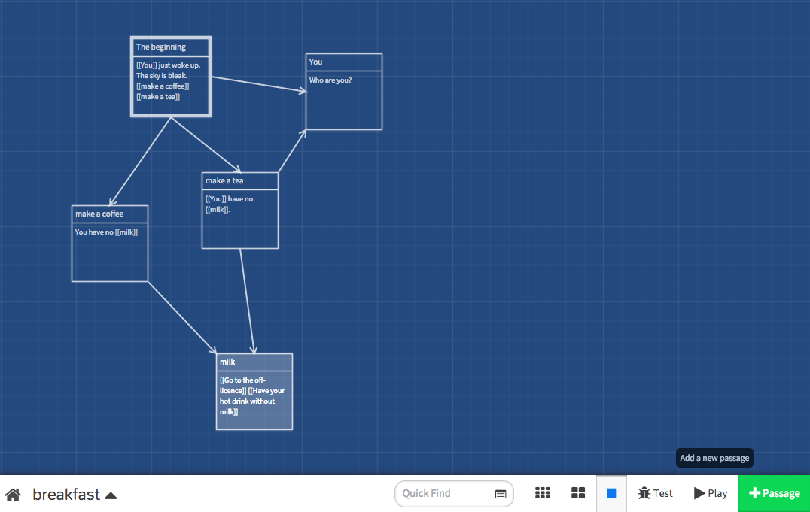

# Web Stories

Can you type? Do you have a **story to tell**?

That's all you need to get started with *Web Stories*: a fun, fast-paced workshop that will teach you how to craft an **interactive story** and publish it on the Web for everyone to play!

Suitable for people who (think they) have never written a line of **code** before. You will be surprised, and learn a few HTML, CSS & JavaScript tricks in the process :)

### Plan

When | What
---- | ----
Tuesday 26.01 | What is a story?  What is the Web?  Introducing [Twine](twine), a free online tool to make *interactive stories*
Thursday 28.01 | What is *your* story?  Craft your story with Twine  Introducing HTML & CSS, the languages of the Web
Saturday 28.01 | Tweak your story  Play-testing!

### License

This work is licensed under a [Creative Commons Attribution-NonCommercial-ShareAlike 4.0 International License ](http://creativecommons.org/licenses/by-nc-sa/4.0)