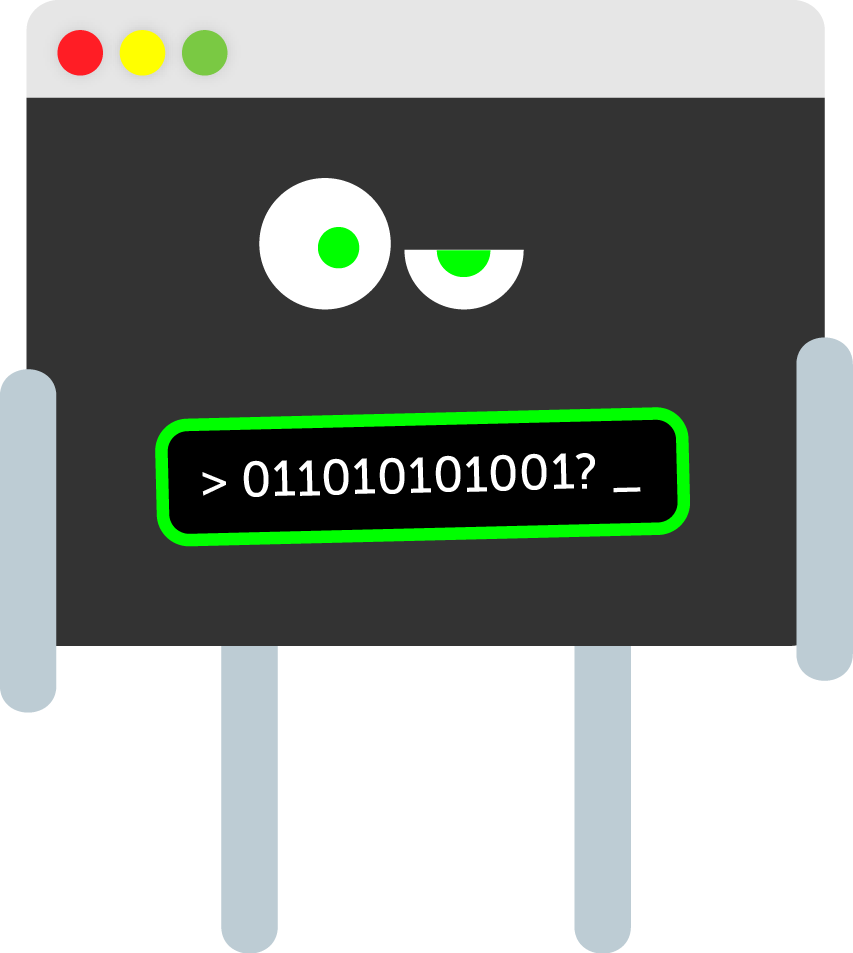
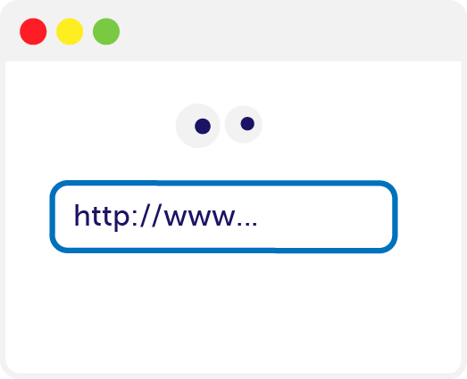
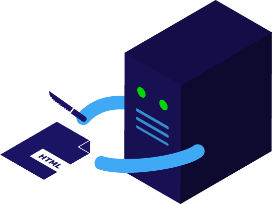

# Presentation

* [Hands up if you..](#show-of-hands)

* What's [today about](#today)?
	* When is [lunch](#when-is-lunch)?
	* [**Roadmap**](#roadmap): what are we going to do and learn?
* [Nice to meet you](#nice-to-meet-you)
	* [Two words about ourselves](#two-words-about-ourselves)

* [What is code?](#what-is-code)

* [What is the Web?](#what-is-the-web)

* [What is a story?](#what-is-a-story)

* A *story* written in *code* on the *Web*?!

* Form teams

* Let's make <del>story*boards*</del> story**maps**

* Twine <!--links to a different MD-->

- [ ] Code > Web > story: is this the most sensible order?

##  Show of hands

* Who's read a story before today?
* Who's **written** a story before today?
* Who's plaid a game before today?
* Who's **made** a game before today?
* Who's done any coding before today? 

## Today

You may think you have never written a line of *code* before.

We're here to demonstrate this is not the case.

- [ ] [You already code](https://medium.com/on-coding/you-can-already-code-you-just-dont-know-it-yet-862044601a5a)

You will be surprised, and learn a few HTML, CSS and JavaScript tricks in the process :)

Today is about **storytelling**, with a *pinch of code*.

We will show you a few **coding tricks** and we'll lay the **foundations** of your stories together. 

Then you will explore the **potential of the Web** as an open platform for you to **express your creativity**.

By making an interactive story and publishing it to the Web today, you will get to know the *fabrics* of the Web (HTML, CSS and JavaScript), and become **confident in tinkering with code**. To see code as one tool in your **creative toolbox**, and not something scary or too complex.

<!--You may want to become a fashion designer, or a (ask)? However as a **creative professional in the 21st century you can’t be Web-illiterate**. Just like you have to be able to read and write, and do some maths. You need to understand a bit of code. -->

You don't have to be a nerd, the Web is for everyone.

Being Web-literate will enable you to use the Web as an **open platform**, a place where you can be a **maker**, instead of a **consumer**. 

<!--Also it's a highly paid industry...--> 

### When is lunch?

Research shows that people focus much better when they know what time they're going to eat..

So, we will have **lunch break** at around 12:30 for 1 hour, aiming to wrap up by 3:30pm.

### Roadmap

When | What
---- | ----
10:20 - 10:30 | Sign in and welcome to Ravensbourne
10:30 - 11:00 | What is the Web?  What is a story?
11:00 - 11:30 | Working in groups: story ideas
11:30 - 12:30 | Twine: a free online tool to make interactive stories 
12:30 - 13:30 | Lunch ` `
13:30 - 15:00 | Working in groups: craft your story with Twine
15:00 - 15:30 | Play-testing!

## Nice to meet you

We want this workshop to be **informal** and relaxed, so if you have any questions at any time just ask. We're also going to ask you many **questions**!
	
We'd like you to introduce yourself to your neighbour. 
 
We'll then ask you to introduce each other to the rest of the group.

1. A bit about yourself
* Why are you here today?
* [ ] What is your experience with coding so far?

You can jot down the answers on post-its and we'll then stick them on the wall...

### Two words about ourselves

* Matteo studied graphic design. He built various social platforms and educational games for the BBC, Science Museum and now teaches at Ravensbourne.
* [ ] Student 1
* [ ] Student 2

**No computer scientists**, learned code by ourselves and built a career on it.

We're all curious and passionate about sharing our knowledge.

We believe **everyone can learn to code** and that's why we're here today. We want to help you find your direction and accelerate your learning process.

## What is code?

Can you fill in the blanks?

Think of words with `code` in them? (*Morse code*, *post code*, *dress code*...)

Code existed **before computers**.

Code is about
*   transmitting information
*   giving instructions
*   **communication**

If I want to talk to my **grandma**, I need to use Italian. To communicate with you, I use English. To **talk to a computer**, I use..

It's **instructions** to a computer: extremely powerful, fundamentally thick.

### Thick machines

Imagine a computer is your most picky/pedantic **friend**: 

* **break down** every step, in order
* be extremely **precise**
* it will take you **literally**

### What are computers good at?

COMPUTERS → **Computing** (calculating very fast, comparing quantities), **repeating** (boring) tasks endlessly, **executing** instructions, **storing** data. 

### What are you good at?	

PEOPLE → **Spotting patterns** (connecting the dots), thinking **outside the box**, **inventing** new tools and new ways to use old **tools**.

**Code is a tool**, is how we can get computers to do the **heavy lifting for us**, so that we can focus on being **creative**.

PEOPLE are **good at writing code**.

### How do you learn to code?

Remember how you learned your first language as a child?

Like **learning a new language**, **translating** your ideas into code.

<!--**Today** you're going to learn **2 new languages**.-->

### Copy + hack

How did you learn your first language as a child?

You learned your first language by *copying* people around you..

How did you learn to **write**?

**Today** you're going to **copy us** for a bit, then **hack** what you copied into something **new**.

## What is the Web?

The Web is not the Internet. If the Internet is a global **brain** (infrastructure), the Web is all the **memories and thoughts** that run on top of it.

### Super-short history

* The Internet started as a military project shortly after WW2. Fearing a soviet nuclear attack, the American army designed a **resilient de-centralised network**: if one *node* goes down, communication can still happen between the other nodes.

* Internet expands beyond the military and is adopted by business and academia. People start sending *emails*. 

* The WWW started as a way of **linking** academic documents together, over **2 computers in Switzerland**. 

* Tim Berners-Lee (TBL or Timbo): 

	> Wouldn't it be great if I could have all my research data always **available** on this computer, and people can just fetch it from there, rather than me having to send emails? In fact, wouldn't it be great if **all the information in the World** could be always available? If every piece of data had an **address** where we can find it, like we find people at certain addresses?
	
	This is not an actual quote from TBL, but rather an interpretation of what he may have thought before inventing the WWW

* Timbo's idea: **hypertext + Internet = WWW**, he specified a set of **rules** (HTTP) for computers to exchange documents over the Internet, and a standard **format** for these documents (HTML). 

### How does it WWWork?

You enter an address or click somewhere.

The **browser** turns your request into a HTTP request and sends it out to the Internet, to find a resource/page/site that responds to your request.

If you haven't mistyped your request, this will reach a server on the other end.

A **server** is a computer that is always on. Receives requests and cooks responses, which are sent back to the browser as **HTML+CSS+JS code**.

**RESTaurant analogy**. Sometimes (in the old days) the server sends back a **cooked meal**, in most cases it sends back a list of **ingredients** and a **recipe**.

### HTML + CSS + JavaScript

Different **languages**, different **concerns** (or jobs/purposes)

HTML → structure and content 

CSS → style and design 

JS → behaviour and logic

**RECIPE analogy** (ingredients - serving suggestions - method)

_BBC homepage example > disable CSS to show what code does what_

## What is a story?

> **Stories** are the most powerful delivery tool for information, more powerful and enduring than any other art form.

> From [Storyboarding & UX](http://johnnyholland.org/2011/10/storyboarding-ux-part-1-an-introduction)

Gustav Freytag rationalised stories into five acts: exposition, rising action, climax, falling action (or final suspense and resolution) and dénouement (conclusion).

### Linear vs nonlinear

- [ ] Let's **brainstorm** concepts related to games, stories, what they have in common and what they don't have in common.

# Branching narratives

> If I throw a ball at you, I don’t expect you to drop it and wait until it starts telling stories

[Markku Eskelinen](http://www.gamestudies.org/0101/eskelinen)

<!--Let's **brainstorm** concepts related to games, stories, what they have in common and what they don't have in common.-->

Before videogames...

* **Dada** poems
	
	>	**To make a Dadaist poem**
	
	> * Take a newspaper.
	> * Take a pair of scissors.
	> * Choose an article as long as you are planning to make your poem.
	> * Cut out the article.
	> * Then cut out each of the words that make up this article and put them in a bag.
	> * Shake it gently.
	> * Then take out the scraps one after the other in the order in which they left the bag.
	> * Copy conscientiously.
	> * The poem will be like you.
	> * And here you are a writer, infinitely original and endowed with a sensibility that is charming though beyond the understanding of the vulgar.
	
	[Tristan Tzara, 1920](http://en.wikipedia.org/wiki/Tristan_Tzara)

* Jorge Luis Borges **[The Garden of Forking Paths](http://en.wikipedia.org/wiki/The_Garden_of_Forking_Paths)** (1941)
	
	In the short story a character named Ts'ui Pên tells everybody that he wanted to write a book and build a labyrinth. Nobody ever found the labyrinth, only a very confusing and contradictory book. We then discover that the book *is* the labyrinth. In the fictional book, every chapter is followed by "every" possible continuation.

* Raymond Queneau **[Hundred Thousand Billion Poems](http://www.bevrowe.info/Queneau/QueneauRandom_v4.html)** (1961)

	Derived from a set of ten basic sonnets, they are printed on card with **each line on a separated strip**, like a heads-bodies-and-legs book. All ten sonnets have the same rhyme scheme and employ the same rhyme sounds. As a result, any line from a sonnet can be combined with any from the other nine, giving 1014 (= 100,000,000,000,000) different poems. Working twenty-four hours a day, it would you take some 140,000,000 years to read them all.
	
	

* [Gamebooks](http://samizdat.cc/cyoa), aka *Choose Your Own Adventure* in the 1970s and 80s

	
	
	You can find many of them on [Project AON](http://www.projectaon.org/en/Main/Books)

* **HyperText** is a word [Ted Nelson](http://en.wikipedia.org/wiki/Ted_Nelson) coined in the 60s. 

	> A system of **non-sequential writing** that would allow the reader to aggregate meaning in snippets, in the order of his or her choosing, rather than according to a pre-established structure fixed by the author.
	
	We're now familiar with hypertext because of the World Wide Web (invented in 1989) but in the 80s it was quite a weird thing, with a literary potential.

<!--Examples: [Afternoon](http://www.wwnorton.com/college/english/pmaf/hypertext/aft/index.html) and [253](http://www.ryman-novel.com/)-->

* **Text Adventures** like [ZORK](http://en.wikipedia.org/wiki/Zork) were massively popular in the 80s.

	

<!--[Choose your own adventure](http://www.theguardian.com/commentisfree/2014/oct/20/gamergate-internet-toughest-game-woman-enemies) (sort of) by Charlie Brooker-->

More and more on [Electronic Literature](http://directory.eliterature.org)

### Storyboarding

> Storyboarding has always been the **low-fidelity prototype of film [and animation]**, bringing together the elements of script, plot, scene, and characters.

#### You don’t need to be good at drawing

> When thinking about storyboarding, most people get stuck on their (perceived) **inability to draw**.

- [ ] Let's call it `story-mapping`

