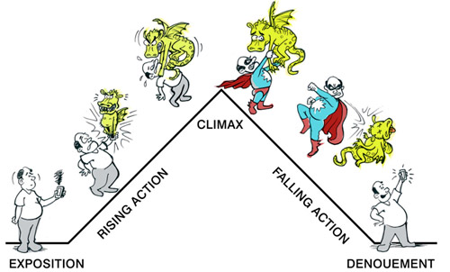
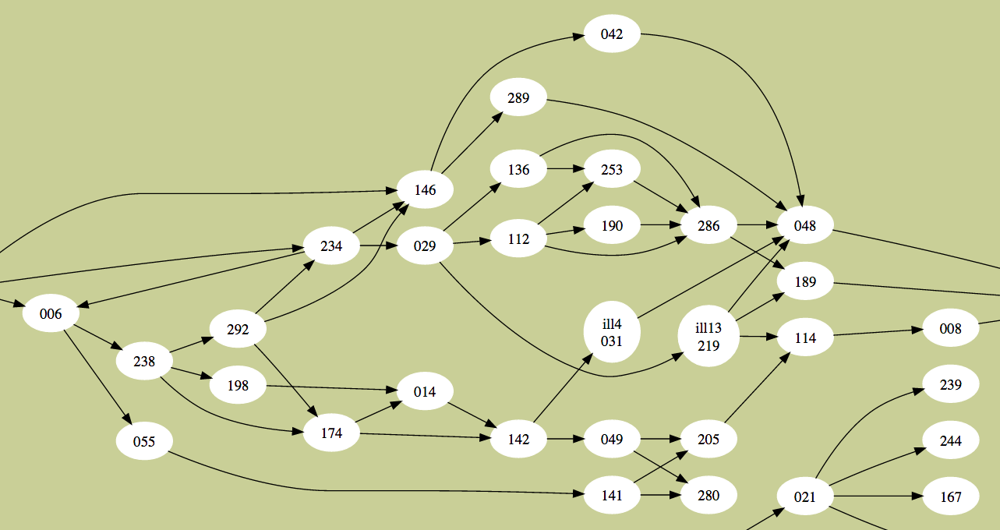
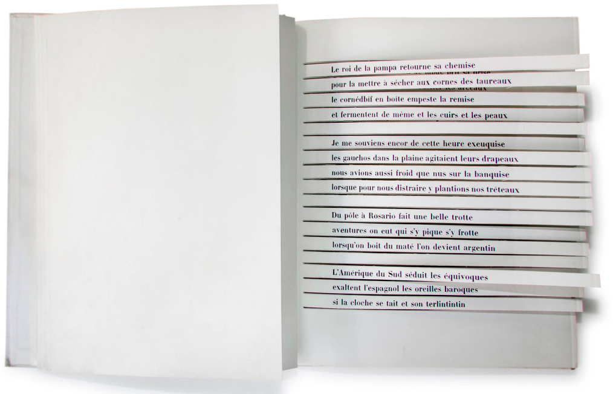
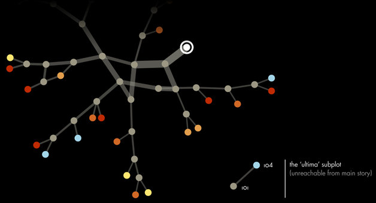
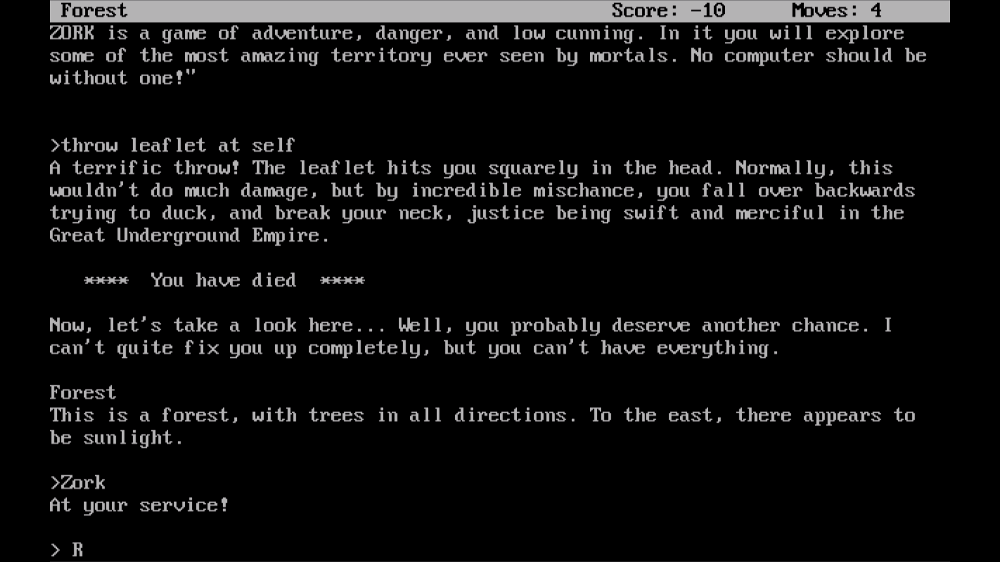
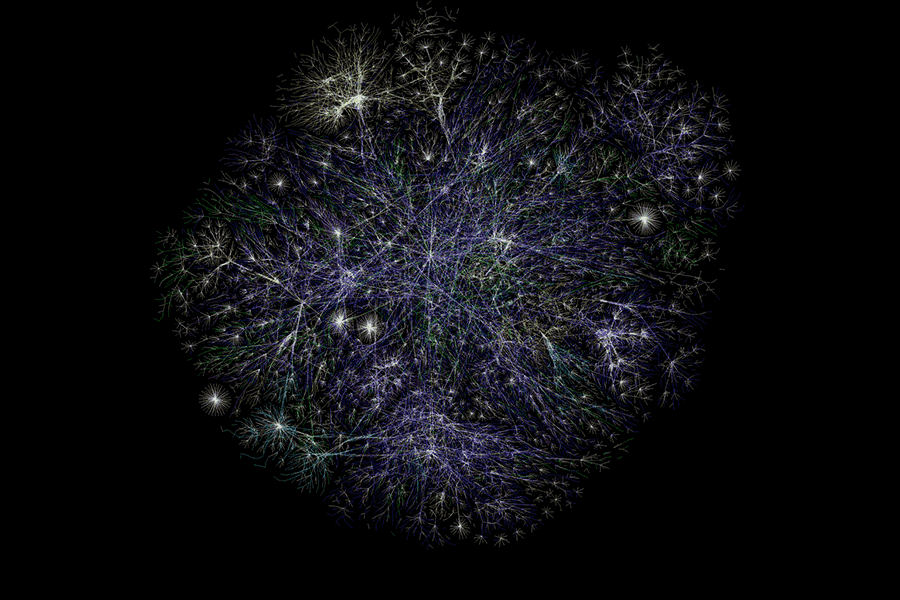

<!--

ESSENTIAL 

- [x] Review intro questions
- [x] Story examples
- [x] Story line
- [ ] Snow White with vars and ifs..
- [ ] Review story ideas
- [x] Post-its
- [ ] Margot intro 
- [ ] Whiteboard / flipboard for brainstorming?

OPTIONAL

- [ ] Image for main README
- [ ] Links for main README
- [ ] Reveal presentation

-->

# Presentation

* [Hands up if you..](#show-of-hands)

* What's [today about](#today)?
	* When is [lunch](#when-is-lunch)?
	* [Roadmap](#roadmap): what are we going to do and learn?
* [Nice to meet you](#nice-to-meet-you)
	* [Two words about ourselves](#two-words-about-ourselves)

* [What is a story?](#what-is-a-story)
	* [Story ingredients](#story-ingredients)
	* [Story lines](#story-lines)
	* [From text to hypertext](#from-text-to-hypertext)
	
* [What is the Web?](#what-is-the-web)
	* [The story of the Web](#the-story-of-the-web) 

* [Your story](#your-story)
	* [Let's make story**maps**](#story-mapping)

* [Twine](../twine/README.md)

# Hello

<!--
I'm Matteo. I teach here..
I'm ...
-->

##  Show of hands

* Who's read a story before today?
* Who's **written** a story before today?
* Who's plaid a game before today?
* Who's **made** a game before today?
* Who's done any coding before today? 

## Today

You may think you have never written a line of *code* before.

We're here to demonstrate this is not the case.

<!--- [ ] [You already code](https://medium.com/on-coding/you-can-already-code-you-just-dont-know-it-yet-862044601a5a)-->

<!--You will be surprised, and learn a few HTML, CSS and JavaScript tricks in the process :)-->

Today is about **storytelling**, with a *pinch of code*.

We will show you a few **coding tricks** and we'll lay the **foundations** of your stories together. 

Then you will explore the **potential of the Web** as an open platform for you to **express your creativity**.

<!--By making an interactive story and publishing it to the Web today, you will get to know the *fabrics* of the Web (HTML, CSS and JavaScript), and become **confident in tinkering with code**. To see code as one tool in your **creative toolbox**, and not something scary or too complex.-->

You don't have to be a nerd, the Web is for everyone.

Being *Web-literate* will enable you to use the Web as an **open platform**, a place where you can be a **maker**, instead of a **consumer**. 

<!--Also it's a highly paid industry...--> 

### When is lunch?

Research shows that people focus much better when they know what time they're going to eat..

So, we will have **lunch break** at around 12:30 for 1 hour, aiming to wrap up by 3:30pm.

### Roadmap

When | What
---- | ----
10:30 - 11:00 | [What is a story?](#what-is-a-story)  [What is the Web?](#what-is-the-web)
11:00 - 11:45 | Working in groups: story ideas
11:45 - 12:30 | [Twine](../twine/README.md): a free online tool to make interactive stories 
12:30 - 13:30 | Lunch ` `
13:30 - 15:00 | Working in groups: craft your story with Twine
15:00 - 15:30 | Play-testing!

## Nice to meet you

We want this workshop to be **informal** and relaxed, so if you have any questions at any time just ask. We're also going to ask you many **questions**!
	
We'd like you to introduce yourself to your neighbour. 
 
We'll then ask you to introduce each other to the rest of the group.

1. A bit about yourself
* What's your favourite story?
* What is your experience with coding so far?

You can jot down the answers on post-its and we'll then stick them on the wall...

### Two words about ourselves

<!--
Matteo introduces Simeron
Simeron introduces Margot
Margot introduces Matteo
-->

## What is a story?

> An **account** of an event or a **series of events**, either true or fictitious.

> Definition from the [Free Dictionary ](http://www.thefreedictionary.com/story) 

..or

> A story is a promise that the end is **worth waiting for**.

> [Mallary Jean Tenore](http://www.poynter.org/how-tos/writing/200728/theres-no-such-thing-as-first-person-omniscient-when-writing-a-personal-story)

### What makes a story?

**Compare**:

1. > A `blog` is a personal journal published on the World Wide Web consisting of discrete entries known as `posts`, typically displayed in reverse chronological order to the most recent post appears first. Blogs are usually the work of a single individual, occasionally of a small group, and often themed on a single subject.

	Is *this* a story?

2. > Meet Danny. She recently created a website where she posts information about her experiences raising a puppy. Her website is an online journal, or `blog`, where she posts a new entry that appears at the top of her page every few days. This stream of entries has enabled her to connect with dog lovers from around the world.

	Is *this* a story?

3. > In 2006 David Maister, an expert in professional service firms, started his `blog`. A blog is like an online journal. David would share his thoughts day-by-day, with his latest ideas appearing at the top of the page. He also encouraged his readers, like me, to leave comments.

	> As I was just starting my business I thought I would email David seeking his help. He called me from Boston the next day and to my surprise he said he would waive his high fees because he now thought of me as a friend after reading my online comments on his blog.

	Is *this* a story?

The examples above are adapted from [Fact telling vs story telling](http://www.anecdote.com/2013/01/fact-telling-versus-story-telling/).

### Story ingredients

1. **Time** or **place** marker
* Things happening (ie **events**) 
* Something **unexpected**

The third point is what can turn a story into a great story.

#### Just for heroes?

[Gustav Freytag](https://en.wikipedia.org/wiki/Gustav_Freytag) rationalised stories into five **acts**: 

* Exposition
* Rising action
* Climax
* Falling action (or final suspense and resolution)
* Dénouement (conclusion)

This dramatic structure is known as the [Freytag's pyramid](https://en.wikipedia.org/wiki/Dramatic_structure#Freytag.27s_analysis).

This structure has been used for thousands of years across the world to tell epic tales of heroes overcoming huge challenges. See [monomyth](https://en.wikipedia.org/wiki/Monomyth)

However, many people argue that not all stories need a challenged hero. In fact, most stories are not about heroic events, but rather *coincidences*. That is, **something unexpected**.

<!--- [ ] ["How to tell a story" TED playlist](http://www.ted.com/playlists/62/how_to_tell_a_story)-->

### Story lines

Let's make a story. 

1. Line people up on one side of the room. 
2. On the other side is the *story line*. 
3. One person at a time moves to the story line and says their story line.   
	The first two people must either choose the beginning (eg: *Once upon a time*) or the end of the story (eg: *And since then, everyone revered her*).   
	Everyone can take their spot in between the beginning and the end. 
4. Every time someone joins the line, the story loops from the beginning.

### Linear vs nonlinear

Even though the story we created ends up being **linear**, we could see how at every turn the story could change, taking a completely different path.

Let's start thinking about stories like **maps of events**. 

As storytellers, our job is to join the dots, and guide our listeners/readers/players through one path (or paths).

### From text to hypertext

Interactive / nonlinear stories existed before videogames:

* **Dada** poems
	
	>	**To make a Dadaist poem**
	
	> * Take a newspaper.
	> * Take a pair of scissors.
	> * Choose an article as long as you are planning to make your poem.
	> * Cut out the article.
	> * Then cut out each of the words that make up this article and put them in a bag.
	> * Shake it gently.
	> * Then take out the scraps one after the other in the order in which they left the bag.
	> * Copy conscientiously.
	> * The poem will be like you.
	> * And here you are a writer, infinitely original and endowed with a sensibility that is charming though beyond the understanding of the vulgar.
	
	[Tristan Tzara, 1920](http://en.wikipedia.org/wiki/Tristan_Tzara)

* Jorge Luis Borges **[The Garden of Forking Paths](http://en.wikipedia.org/wiki/The_Garden_of_Forking_Paths)** (1941)
	
	In the short story a character named Ts'ui Pên tells everybody that he wanted to write a book and build a labyrinth. Nobody ever found the labyrinth, only a very confusing and contradictory book. We then discover that the book *is* the labyrinth. In the fictional book, every chapter is followed by "every" possible continuation.

* Raymond Queneau **[Hundred Thousand Billion Poems](http://www.bevrowe.info/Queneau/QueneauRandom_v4.html)** (1961)

	Derived from a set of ten basic sonnets, they are printed on card with **each line on a separated strip**, like a heads-bodies-and-legs book. All ten sonnets have the same rhyme scheme and employ the same rhyme sounds. As a result, any line from a sonnet can be combined with any from the other nine, giving 1014 (= 100,000,000,000,000) different poems. Working twenty-four hours a day, it would you take some 140,000,000 years to read them all.
	
	

* [Gamebooks](http://samizdat.cc/cyoa), aka *Choose Your Own Adventure* in the 1970s and 80s

	
	
	You can find many of them on [Project AON](http://www.projectaon.org/en/Main/Books)

* **HyperText** is a word [Ted Nelson](http://en.wikipedia.org/wiki/Ted_Nelson) coined in the 60s. 

	> A system of **non-sequential writing** that would allow the reader to aggregate meaning in snippets, in the order of his or her choosing, rather than according to a pre-established structure fixed by the author.
	
	We're now familiar with hypertext because of the World Wide Web (invented in 1989) but in the 80s it was quite a weird thing, with a literary potential.

<!--Examples: [Afternoon](http://www.wwnorton.com/college/english/pmaf/hypertext/aft/index.html) and [253](http://www.ryman-novel.com/)-->

<!--* **Text Adventures** like [ZORK](http://en.wikipedia.org/wiki/Zork) were massively popular in the 80s.

	-->

<!--[Choose your own adventure](http://www.theguardian.com/commentisfree/2014/oct/20/gamergate-internet-toughest-game-woman-enemies) (sort of) by Charlie Brooker-->

<!--More and more on [Electronic Literature](http://directory.eliterature.org)-->

## What is the Web?

The Web is not the Internet. 

If the Internet is a global **brain** (infrastructure), the Web is all the **memories and thoughts** that run on top of it.

### The story of the Web

* The Internet started as a military project shortly after WW2. Fearing a soviet nuclear attack, the American army designed a **resilient de-centralised network**: if one *node* goes down, communication can still happen between the other nodes.

* Internet expands beyond the military and is adopted by business and academia. People start sending *emails*. 

* The WWW started as a way of **linking** academic documents together, over **2 computers in Switzerland**. 

* Tim Berners-Lee (TBL or Timbo): 

	> Wouldn't it be great if I could have all my research data always **available** on this computer, and people can just fetch it from there, rather than me having to send emails? In fact, wouldn't it be great if **all the information in the World** could be always available? If every piece of data had an **address** where we can find it, like we find people at certain addresses?
	
	This is not an actual quote from TBL, but rather an interpretation of what he may have thought before inventing the WWW

	

* Timbo's idea: **hypertext + Internet = WWW**. He *specified* a set of **rules** (HTTP) for computers to exchange documents over the Internet, and a standard **format** for these documents (HTML). 

* Timbo invented the WWW in **1989**. The rest is history. 

	

## Your story

Today you'll make a **hypertext**, a small-scale version of the Web.

You'll then publish your story on the Web for everyone to *play*!

> This is for everyone

> Timbo, London 2012

In its short history, the Web has given voice to millions.

The Web is an amazing **open platform** for you to express your creativity and tell the stories that matter to you.

Today you are going to be a **maker** instead of a **consumer**. 

### Story-mapping

Form groups of 2, aka pairs.

Come up with at least **2 story ideas**. After lunch you'll develop one of them as a hypertext.

* Think about your story as a **map**. 
* Jot down all the *points* in your story and then start *linking* them.
* Remember: it's about **choices**. 
* Make sure there are several paths, not just a single line.

They can be your own ideas, remixes of existing narratives, or if you're stuck you can pick from these examples:

1. Remix a fairy tale
2. Turn a videogame sequence into a story (eg: Bioshock, Assassin's Creed, Mario, Minecraft, Flappy Bird, Tetris)
3. Bird conspiracy (thanks Margot)
4. A conversation going wrong
5. A deadly day: whatever happens, after 24h you die (or win the lottery)
6. A dog's life
7. Simeron's relationship
8. Story of a migrant
9. Superhero not so super
10. Current affairs: what if Scotland broke free?
11. What if David Cameron was an alien?
12. Pick a story from the news and re-invent it. Or tell it from a different moral perspective.
13. Spy story?
14. Chase: cat and mouse.
15. You wake up one day and you are a factory farm cow.
16. You wake up in a deserted Ravensbourne after the apocalypse.