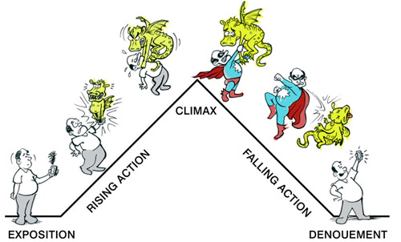

<!--

- [x] Managing expectations:
 			not coding for coding's sake, some title etc
 			coding as a tool in your creative toolbox 
 			introduce Twine, but not use it today
 
- [ ] Examples of unconventional storytelling:

	* Jessica Hisch wedding invitation
	* Bunt blood from scroolmagic 			
- [ ] homework 
			storymap
			play a Twine
			prepare assets

-->

# Today, Tuesday 26th of January

1. [What is this workshop about](#hands-up-if-you)?
* [What is a story](#what-is-a-story)?
* [What makes a story](#what-makes-a-story)?
* [How does a story unfold](#how-does-a-story-unfold)? 
* Story lines
* Non-linear stories
* Your story

# Hands up if you...

### ...*read* a **story** before today?

What stories do you like reading?

### ...*told* a **story** before today?

What was the last story you told? 

How do people experience your stories?

### ...*played* a **game** before today?

What games do you like playing?

### ...*made* a **game** before today?

Ever changed the rules of a game you play, even slightly? 

Ever asked someone a question that quizzed them, or puzzled them? That's a game too.

### ...*wrote* any **code** before today? 

You probably heard that you **should learn** to code, right?

But what is the **purpose**?

Coding for coding's sake has little purpose. 

<!-- story of Aimee's knitting experiments -->

### Code as a means, not an end

Code can be a **tool** in your creative toolbox.

*With* code, you can make things for people. Like games and stories. 

Today, we are going to start designing and making **interactive stories**.

We will use a tool called [Twine](../../twine) to **code** your interactive stories and publish them on the Web.

We will show you a few **coding tricks** and lay the foundations of **your stories** together. 

# What is a story?

> An **account** of an event or a **series of events**, either true or fictitious.

> Definition from the [Free Dictionary ](http://www.thefreedictionary.com/story) 

...or

> A story is a promise that the end is **worth waiting for**.

> [Mallary Jean Tenore](http://www.poynter.org/how-tos/writing/200728/theres-no-such-thing-as-first-person-omniscient-when-writing-a-personal-story)

### What makes a story?

**Compare**:

1. > A `blog` is a personal journal published on the World Wide Web consisting of discrete entries known as `posts`, typically displayed in reverse chronological order to the most recent post appears first. Blogs are usually the work of a single individual, occasionally of a small group, and often themed on a single subject.

	Is *this* a story?

2. > Meet Danny. She recently created a website where she posts information about her experiences raising a puppy. Her website is an online journal, or `blog`, where she posts a new entry that appears at the top of her page every few days. This stream of entries has enabled her to connect with dog lovers from around the world.

	Is *this* a story?

3. > In 2006 David Maister, an expert in professional service firms, started his `blog`. A blog is like an online journal. David would share his thoughts day-by-day, with his latest ideas appearing at the top of the page. He also encouraged his readers, like me, to leave comments.

	> As I was just starting my business I thought I would email David seeking his help. He called me from Boston the next day and to my surprise he said he would waive his high fees because he now thought of me as a friend after reading my online comments on his blog.

	Is *this* a story?

The examples above are adapted from [Fact telling vs story telling](http://www.anecdote.com/2013/01/fact-telling-versus-story-telling/).

* All three texts **convey facts**, explaining us what a `blog` is and how it works.  
 
* The first text is **not a story**.   

* The second and third texts **are stories**.

* The third text is a better story because it harnesses **feelings**.

#### Your turn

In pairs, pick an object in this room and write a short story (max 2 paragraphs) to explain it.

15 minutes.

<!-- 

Exercise (option 2): in pairs, tell the story of something interesting that happened to your team mate in the last week

-->

#### Story ingredients

1. **Time** or **place** marker
* Things happening (ie **events**) 
* Something **unexpected**

The third point is what can turn a story into a great story.

[How to tell a great story](http://sethgodin.typepad.com/seths_blog/2006/04/ode_how_to_tell.html) by Seth Godin.

### How does a story unfold?

[Gustav Freytag](https://en.wikipedia.org/wiki/Gustav_Freytag) divided stories into five **acts**: 

1. Exposition
* Rising action
* Climax
* Falling action (or final suspense and resolution)
* Dénouement (conclusion)

This dramatic structure is known as the [Freytag's pyramid](https://en.wikipedia.org/wiki/Dramatic_structure#Freytag.27s_analysis).

It has been used for thousands of years across the world to tell epic tales of heroes overcoming huge challenges. See [monomyth](https://en.wikipedia.org/wiki/Monomyth)

However, many people argue that not all stories need a challenged hero. In fact, most stories are not about heroic events, but rather *coincidences*. That is, **something unexpected**.

#### Not just `Once upon a time`

What else you can use a story for? 

* A **resume** that tells the story of you
* A **portfolio** that tells the story of your work
* A **case study** that tells the story of your project
* A **storyboard** that presents your research
* A story that illustrates a **poem**
* A story that lets you **explore a space**

<!-- 

Examples of unconventional storytelling:

-->