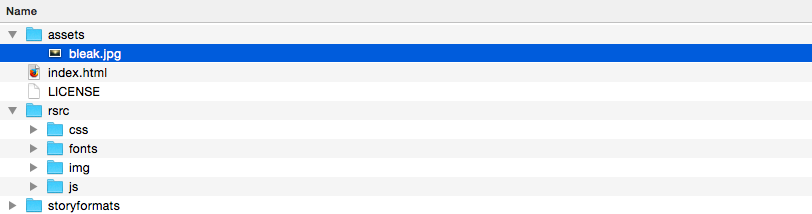
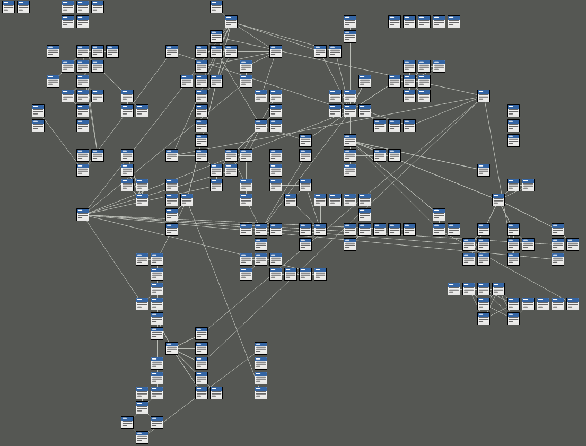

# Twine

<!---->

> [Twine](http://twinery.org) is an open-source tool for telling interactive, nonlinear stories.

> You don't need to write any code to create a simple story with Twine, but you can extend your stories with variables, conditional logic, images, CSS, and JavaScript when you're ready.

Great examples of interactive narratives made with Twine:

* [Ultra business tycoon III](http://aliendovecote.com/uploads/twine/tycoon/crime.html)
* More [games by Porpentine](http://aliendovecote.com/hypertext.html)


<!-- Review of UBT3  on http://www.gamasutra.com/view/news/198341/The_poignant_vocabulary_of_Porpentines_Ultra_Business_Tycoon_III.php -->

Learn how to use Twine on the [Twine Wiki](http://twinery.org/wiki/twine2:guide). 

### Getting started

1. Go to [Twine](http://twinery.org) and **download version 2**
2. Unzip the Twine package
3. Open the `index.html` in your favourite browser
4. Click on `+ Story` to create a new story.


Your story *building blocks* are called **passages** and Twine lets you move them around in this *map*.

### Editing passages

Double-click a passage to edit it.

Twine uses a  *markup language* similar to MarkDown, called [**TwineMarkup**](http://twine2.neocities.org). 

Click on the rocket :rocket: icon to set a passage as the **starting point** of your twine.

### Linking passages

To set your story in motion you create clickable **hyperlinks between passages**. 

```
You just woke up. The sky is bleak.

* [[Make a coffee->coffee]] is a link that goes to a passage named "coffee"
* [[tea<-Make a tea]]  is a link that goes to a passage named "tea"
```

Inside matching non-nesting pairs of `[[` and `]]`, place the link text and the passage expression, separated by either `->` or `<-` with the arrow pointing to the passage expression.

### Jumping to passages

Sometimes you want to take people straight to a passage, without them having to click. Or as a result of a certain event...

```
(display: "tea")
```

### External links

You can use good old HTML to include hyperlinks

``html
<a href="https://twitter.com/baddeo" target="_blank">Baddeo</a>?
```


### Images

You can use good old HTML to include images

```html

<!-- you can also use HTML comments to make notes and hide secret messages -->
<!--  -->
```

Create a sub-folder in the Twine folder and call it `images` or `assets` or whatever you like, and dump all your story media files in there.



Later, when you publish your story, you will need to copy all your `assets` in the same folder where your story is published, so that you won't have broken links.

More on that [here](http://twinery.org/forum/discussion/comment/6056/#Comment_6056).


### Variables

So far we've just linked a bunch of texts (*hypertext*).

How about keeping a *score*? Or asking players a *question* and then using their answer later on in the game?

<!--The code that a passage can contain includes ways of setting a variable to a particular value and conditionally displaying text based on variables' current values.--> 

```
You had no milk for $milkDays days. 
You have $quid quid on you. 
```

`$milkDays` and `$quid` are variables.

All variables must start with `$`, like in PHP :elephant:

#### Setting variables

You can manipulate your *game state* with **macros**, which are snippets of code to set or compare variables.

```
(set: $milkDays to 2)
```

You may want to set certain variables at the very beginning of your twine, in the first *starting point* passage.

<!--Geeks call this to *initialise variables*.-->

To increment a numeric variable

```
(set: $milkDays to $milkDays + 1) 
```

#### Comparing variables

```
(if: $quid is 0) [You need to [[get money]] first]
```

### Asking questions

Use the `prompt` function, like in JavaScript 
```
(set: $userName to prompt("What's your name?"))
Hello $userName :)
```

### Randomness

To get a random number in a range of numbers

```
(set: $milkDays to (random: 1,10)) 
```

To display a random word/string from a list
```
Why don't you (print: (either: "tell me", "let him know", "write to her")) how you feel?
```

### Branching logic

To simulate a 50-50 coin flip

```
(if: (either: 0, 1) is 0)[ The off-licence is shut! ]
(else:)[ They have only goat milk ]
```

A slightly more sophisticated example from [this tutorial](http://lambdamaphone.blogspot.co.uk/2015/02/using-twine-for-games-research-part-ii.html)

```
(if: (either: 0, 1) is 0)[  
  The monster bites you! 
  (set: $health to $health - (either: 1,2,3))  
  (if: $health < 1)[ You are [[dead]]! ]  
  (else:)[ Your health is $health. 
    [[fight]] 
    [[flee|main]] ]  
]
(else:)[ You hit the monster!  
  (set:$monsterHealth = $monsterHealth - 1)  
  (if: $monsterHealth < 1)[ The [[monster is dead]]! ]  
  (else:)[    
    Its health is $monsterHealth.
    [[fight]] 
    [[flee|main]] ]  
]
```

### Custom stuff

You can add [your own Javascript and CSS](http://twinery.org/wiki/twine2:adding_custom_javascript_and_css) to twines.

### All together now...

[Watch this video](https://www.youtube.com/watch?v=paDQr05yhkY)!

[](https://www.youtube.com/watch?v=paDQr05yhkY)


<!---->

<!--More sophisticated tools worth mentioning:

* [Undum](http://undum.com/) (allows for more variables/states)

* [Inform 7](http://inform7.com/) it's a whole different way to conceive programming (using natural language)-->

<!--Tutorial on how Twine works (see [this video tutorial](https://vimeo.com/5010370) and the following from that guy), then..-->

# Your turn

Write a branching story with one or more of the following features:

* Non-human main character
* Events out of chronological order
* Multiple characters

Write the first paragraph and (at least) a couple of examples of choices.

Illustrations / images / animations are a bonus.


# Assignments

Try to keep each passage to one or two paragraphs.

Don't provide many choices, provide *interesting choices*.

Think about how your story can be delivered:

* Spatial? Metaphysical? Puzzle?
* Self-aware / self referential?
* First, second, third person?
* Multiple endings? 
* Multiple beginnings?
* Do you control an avatar?
* Does it have graphics? 
* What's the relation between graphics and text?


Publish your *twine* to the Web (your personal Rave Web space, [Philomela](http://www.philome.la), [NeoCities](https://neocities.org), anywhere you like..)


# TODO


- [ ] Which format?


Your work is saved only in your browser.

That means you don't need to create an account to use Twine 2, and everything you create isn't stored on a server somewhere else — it stays right in your browser.

Two very important things to remember, though. Since your work is saved only in your browser, if you clear its saved data, then you'll lose your work! Not good. Remember to use that  Archive button often. You can also publish individual stories to files using the dropdown menu next to the  Play button in the story editor. Both archive and story files can always be re-imported into Twine.

Secondly, anyone who can use this browser can see and make changes to your work. So if you've got a nosy kid brother, look into setting up a separate profile for yourself.