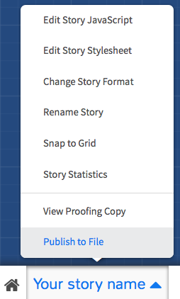

<!--

ESSENTIAL 

- [ ] CSS
- [ ] JS 
- [ ] bit.ly/twine-tutorial


OPTIONAL

-->

# Twine

<!---->

> [Twine](http://twinery.org) is an open-source tool for telling interactive, nonlinear stories.

> You don't need to write any *code* to create a simple story with Twine, but you can extend your stories with *variables*, *conditional logic*, images, CSS, and JavaScript when you're ready.

Here's a quick guide for you to learn the ropes of Twine

1. [Getting started](#getting-started)
* Building blocks: [passages](#editing-passages) and [links](#linking-passages)
* [External links](#external-links), [images](#images), [comments](#comments) and [other amenities](#other-amenities) (maps, videos etc) you can pull in from the Web
* [Custom styles](#custom-styles) aka `CSS`, for instance to change fonts and colours
* [Saving](#saving-your-work) and [publishing your stories](#publishing-your-stories)
* Getting your story to remember stuff: [variables](#variables)
* Asking [questions](#asking-questions)
* Shuffling things up: [randomness](#randomness)
* Taking decisions: [branching logic](#branching-logic)
* Making time tick: [timers](#timers)
* [Custom behaviour](#custom-behaviour) aka `JavaSscript`

### Getting started

1. Go to [twinery.org](http://twinery.org) and click on [**Use it online**](http://twinery.org/2).
	
	<!---->
	  
	If you want to make twines offline, you can download the Twine 2 desktop app.
2. Click on `+ Story` to create a new story.

	

	Your story *building blocks* are called **passages** and Twine lets you move them around in this *map*.

### Editing passages

Double-click a passage to edit it.

Click on the rocket :rocket: icon to set a passage as the **starting point** of your story.

Each passage has:

* a **name**, which must be *unique*, just like you.. the name of a passage *won't be visible* to people reading / playing it 
* **tags**, which we can ignore for now
* a **body** area, which is where you put the *visible / playable* part of your passage


Twine uses a *coding language* called [**TwineMarkup**](http://twine2.neocities.org).

<!--Technically it's a **markup language** because we're marking up text with some code that tells computers what to do with that text, how to display it etc.-->

For example, the `*` character at the beginning of a line will make that line bulleted (aka `unordered list item`)

### Linking passages

To set your story in motion you create clickable **hyperlinks between passages**. 

```
[[You]] were born a princess. 

[[Great. Where's my royal family? ->Mum]]
[[What's my name again? ->You]]
```

Inside matching pairs of `[[` and `]]`, place the link text and the passage name, separated by either `->` or `<-` with the arrow pointing to the passage name.

For example, `[[What's my name again? ->You]]` will display the text `What's my name again?` as a link to a passage named `You`.

#### Jumping to passages

Sometimes you want to take people straight to a passage, without them having to click. Or as a result of a certain event...

```
(display: "Mum")
```

### External links

You can use HTML to include external links (aka `hyperlinks`)

```html
<a href="https://twitter.com/baddeo">Baddeo</a>?
```

This will display the text `Baddeo` as a link to `https://twitter.com/baddeo`. Are you following?

### Images

You can use HTML to include images

```html

```

This will display the image below, which *lives at this address* `http://i.imgur.com/8cubtH2.gif`. 

[](https://en.wikipedia.org/wiki/File:Internet_map_plain_1024.png)

You can *hotlink* images from the Web, provided they're licensed for re-use.

If you use your own images, you can upload them to services like [IMGUR](http://imgur.com/), [Giphy](http://giphy.com/), Dropbox, Google Drive.. it doesn't matter where you upload them, as long as they're *public* on the Web and you get a *link* for them.

### Comments

```html
<!-- you can use HTML comments to make notes and hide secret messages -->
```

Even though people playing your twines can't see them, comments are extremely useful for you and your fellow storytellers to annotate your stories.

### Other amenities

Here's how to:

* [embed a Google map](https://support.google.com/maps/answer/3544418?hl=en)
* [embed a Youtube video](https://support.google.com/youtube/answer/171780?hl=en-GB)
* [embed a tweet](https://support.twitter.com/articles/20169559-embedding-a-tweet-on-your-website-or-blog)

### Custom styles

You can use `CSS` to change the visual style of your twines.

For instance, let's make links pink:

1. Click the `Play` button to preview your twine in a new browser tab
* Right-click on the element you want to change, and choose `Inspect Element`.   
  
	
	
	You can learn more about this very useful method [here](https://developer.chrome.com/devtools/docs/dom-and-styles#inspecting-elements). It works on every Web page, allowing you to inspect and (temporarily) change its HTML and CSS!
	
* Find the property you want to change, eg `color`
* Copy-paste it into your story stylesheet

		
	```css
	.enchantment-link, tw-link {
	    color: #ff00ff;
	}    
	```

The same method is valid for all story elements.
 
### Variables

So far we've just linked a bunch of texts (*hypertext*).

How about keeping a *score*? Or asking players a *question* and then using their answer later on in the game?

```
Your score is $score. 
```

`$score` is a variable, which means its value can vary. Think of it as a box where we can store data that we want the computer to remember.

All variables must start with `$`.

#### Setting variables

You can manipulate your *game state* with **macros**, which are snippets of code to set or compare variables.

```
(set: $score to 0)
```

You may want to set certain variables at the very beginning of your twine, in the first *starting point* passage.

<!--Geeks call this to *initialise variables*.-->

To increment a numeric variable

```
(set: $score to $score + 1) 
```

#### Comparing variables

```
(if: $score is 0) [This text will only display if the score is exactly zero.]
```

### Asking questions

Use the `prompt` function, like in JavaScript 

```
(set: $userName to prompt("What's your name?"))
Hello $userName :)
```

This will pop up an input box saying `What's your name?`.
 
Your answer to that question (aka `prompt`) will be stored in a variable called `$userName`.

<!--
Using inputs
http://twinery.org/forum/discussion/comment/9248/
-->

### Randomness

To get a random number in a range of numbers

```
(set: $bonus to (random: 1,10)) 
```

To display a random word/string from a list

```
Why don't you (print: (either: "tell me", "let him know", "write to her")) how you feel?
```

### Branching logic

You can program your story to take a certain path, depending on what players do / don't do, or based on randomness.

That is, using `if THIS then THAT` logic, you can build complex branching narratives into your twines. 

#### Heads or tails?

To simulate a 50-50 coin flip

```
(if: (either: 0, 1) is 0)[ This text will only display if we get a 0 ]
(else:)[ This text will show if we get a 1 ]
```

#### Life or death?

A slightly more sophisticated example, adapted from [this tutorial](http://lambdamaphone.blogspot.co.uk/2015/02/using-twine-for-games-research-part-ii.html)

```
(if: (either: 0, 1) is 0)[  
  The monster bites you! 
  (set: $health to $health - (either: 1,2,3))  
  (if: $health < 1)[ You are [[dead]]! ]  
  (else:)[ 
  		Your health is $health. 
    	[[Fight]] or [[flight->main]] 
  ]  
]
(else:)[ You hit the monster!  
  (set:$monsterHealth = $monsterHealth - 1)  
  (if: $monsterHealth < 1)[ The [[monster is dead]]! ]  
  (else:)[    
    	Its health is $monsterHealth.
    	[[Fight]] or [[flight->main]]  
  ]  
]
```

We are still flipping the coin, however in this case:

* if you get a `0`, then the *monster* bites you and your health decreases. You may even die, if your `$health` is smaller than 1
* if you get a `1`, then you *hit the monster* and its health decreases. You may even kill the monster, if `$monsterHealth` is smaller than 1


#### Right or wrong?

```
What's 1 + 1?

[2]<rightAnswer|
[3]<wrongAnswer|

(click: ?rightAnswer) [
	(set: $score to $score + 1)
  	(goto: "Success")
]

(click: ?wrongAnswer) [
	(goto: "Failure")
]
```

In the example above, we are asking a question and giving you two options to click: we name one `rightAnswer` and the other `wrongAnswer`.

Depending on which option is clicked:

* if `rightAnswer` we increment the `$score` and take you to a passage named `Success`
* if `wrongAnswer` we just take you to a passage named `Failure`


### Timers

If you want to add some urgency to your story, to get your players to take action quickly, a timer is what you need.

```

<!-- create a $timeLeft variable and set its value to 10 -->
(set: $timeLeft to 10)

<!-- 
every second (live: 1s)
repeat the commands in [ ] square brackets 
-->
(live: 1s) [
	<!-- decrement $timeLeft -->
	(set: $timeLeft to $timeLeft - 1)
	<!-- display $timeLeft -->
	(print: $timeLeft)
	<!-- if $timeLeft is smaller than 0, then take players to the "End" passage-->
	(if: $timeLeft < 0)[(goto: "End")]
]  
```

### Saving your work

Your work is saved only in your browser.

That means you don't need to create an account to use Twine, and everything you create isn't stored on a server somewhere else: it stays right in your browser.

Two very important things to remember, though. 

1. Since your work is saved only in your browser, if you clear its saved data, then you'll lose your work! Not good. 

	Publish your twines by clicking the `Publish to File` button
	
	

2. Anyone who can use this browser can see and make changes to your work. So if you've got a *nosey kid brother*, look into setting up a separate profile for yourself.

### Publishing your stories

You can publish your twines anywhere the Web! 

This is because twines are made of just HTML, CSS and JavaScript: the three universal languages of the Web, which any browser understands.

1. Follow the [instructions above](#saving-your-work) to publish your twine to an HTML file
* Find that HTML file and upload it somewhere on the Web

	You can use a free service like [Philomela](http://www.philome.la) or [NeoCities](https://neocities.org)
	
 	...or, if you have access to a Web hosting service, you can `ftp` your twine there

### Custom behaviour


# Resources

[Twine 2 Guide form the official wiki](http://twinery.org/wiki/twine2:guide)

[Watch this video](https://www.youtube.com/watch?v=paDQr05yhkY)!

[](https://www.youtube.com/watch?v=paDQr05yhkY)


<!-- 
Using Typed.JS to create that RPG feeling
http://twinery.org/forum/discussion/comment/10867
-->


### Examples

Great examples of interactive narratives made with Twine:

* [Ultra business tycoon III](http://aliendovecote.com/uploads/twine/tycoon/crime.html)
* More [games by Porpentine](http://aliendovecote.com/hypertext.html)


<!-- Review of UBT3  on http://www.gamasutra.com/view/news/198341/The_poignant_vocabulary_of_Porpentines_Ultra_Business_Tycoon_III.php -->